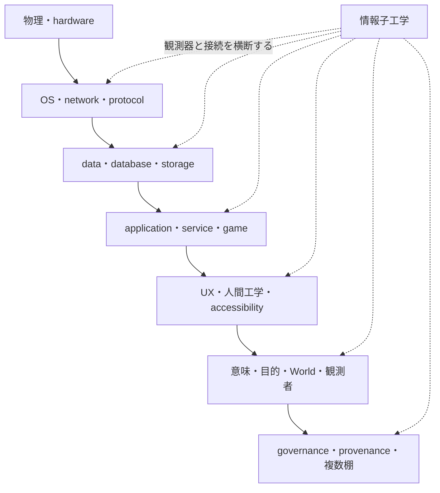
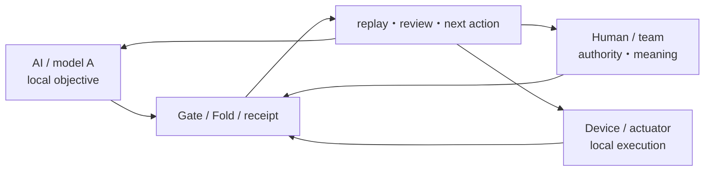

# フルスタックエンジニアのための情報子工学入門

状態: `ALPHA GUIDE / Layer A-C bridge`

情報子工学は、既存のInformation Technology、Computer Science、Software Engineering、Human Factorsを
否定したり、古いものとして置き換えたりする学問ではありません。

TCPが切れているなら、まずnetworkを直します。null参照ならtestを書きます。ボタンが押しにくいなら、
人間工学とアクセシビリティを使います。そのうえで、同じ情報や実装が、誰の、どの目的、どのWorld、
どの観測器へ接続されたときに、別の意味やpainを返すのかまで追うのが、このプロジェクトにおける
情報子工学の射程です。

## 既存工学を土台にする



情報子工学は図の最上段に君臨する新しい支配層ではなく、複数のstackを横断して、入力、観測器、勾配、
出力、接続不能、変換履歴を追うworkbenchです。各層の専門家と既存手法を必要とします。

## 単体AIではなく分散した情報子生態系を扱う

情報子工学の生態系は、複数Worldの商品棚ではありません。異なるAI model、vendor、人間、repository、sensor、
actuator、local processが、それぞれ固有の目的、clock、authority、観測範囲を持ったまま協働する実行topologyです。



最強の一主体へ観測、判断、責任を集約するのではなく、各nodeができること、できないこと、知らないことを保持し、
接続可能な部分だけを交換します。モデルの基礎性能は重要ですが、実効性能はcontext、tool、receipt、handoff、
human review、physical feedbackを含む環境実装によって変わります。

Quantaril Cloudは、この生態系を単一マザーへ吸収せずP2P／E2Eで接続する将来の分散処理面です。
Q Atlantisは、その接続、隔離、権限、World Config、復旧を扱うメタエンジンです。

## 最小の読み方

Manifestの現在の説明では、情報子工学を次の形で表します。

```text
Q(ψ, ∇φ, λ) -> result | ⊥
```

| 記号 | このガイドでの読み方 |
|---|---|
| `ψ` | 扱う情報子、入力、対象 |
| `∇φ` | どの方向へ意味・作用が流れるか |
| `λ` | どの目的・出力・作業台へ渡すか |
| `Q` | どの系、観測器、利用者、validatorが扱うか |
| `⊥` | 接続不能、変換不能、または必要なportがない |

同じ`ψ`でも`Q`、`∇φ`、`λ`が違えば結果は変わります。何でも接続できるとは言わず、接続できないときに
`⊥`を返せることが重要です。

これは、入力が同じなら宇宙のどこでも同じ意味になるという主張ではありません。また、物理量子、
量子インスパイア計算、形而上学を同一実装へまとめる許可でもありません。

## 普通のbugから情報子工学へ上がる順序

1. **L stackを確認する**
   process、file、network、clock、schema、API、権限、依存関係を通常の工学で調べます。
2. **人間工学を確認する**
   身体、認知、入力、表示、支出、離脱、accessibility、利用環境を観測します。
3. **観測器と目的を確認する**
   誰の`Q`が、どの`λ`へ、どのWorld Configで結果を返したかを分けます。
4. **意味と来歴を確認する**
   原語、信仰、ゲーム文脈、組織目的、authority、Sourceを保持します。
5. **接続できなければ止める**
   無理な万能説明を作らず、`⊥`、`unknown`、別World、別作業台へ戻します。

下の段で解けるものを、上の言葉で神秘化しません。上の段に届いているpainを、下のbugだけへ縮退もさせません。

## フルスタックエンジニアの仕事

情報子工学のフルスタックは、全部を一人で専門診断することではありません。接続点と引継ぎを壊さないことです。

- frontendの表示と、ユーザーが受け取った意味を分けて記録する
- backendのstateと、World内で採用されたFactを分ける
- databaseへ保存された文字列と、その宗派・人格・来歴を分ける
- model outputと、operatorが採用した判断を分ける
- bug、UX pain、複合pain、信仰上の解釈を同じseverityへ潰さない
- 実装できないものを`NOT IMPLEMENTED`、接続不能を`⊥`、不明を`unknown`と返す
- 専門棚へ渡しても、Sourceと自分の実装責任を捨てない
- nodeの接続metadataだけから、Source読解、編集、検証、永続性を捏造しない
- localで成立する処理を、中央のglobal clockや単一の意味へ不必要に吸い上げない

## 例: 太鼓バトル

同じ楽曲名でも、音源、譜面、難易度、判定窓、端末補正、handicapが違えば、同一条件の対戦とは限りません。

- IT: timestamp、clock、packet、receiptを扱う
- ゲーム工学: 判定窓、譜面revision、scoreを扱う
- 人間工学: 入力遅延、音響遅延、疲労、端末差を扱う
- 情報子工学: どの条件差を同一Worldの勝敗へFoldしてよいか、観測器と目的を追う
- ゲーマー: 公平で面白いかをHuman-is-the-loopとして評価する

どれか一つだけでゲーム全体を裁定しません。

## 現在の状態

- 本文はQ Atlantis向けの`ALPHA GUIDE`です。
- `Q(ψ, ∇φ, λ)`、`⊥`、観測者を系内へ含める設計はManifestのdraft theoryを参照しています。
- 情報子工学の全数学、FAM runtime、AIM runtimeが完成したという意味ではありません。
- Q Atlantisの旧投稿集は研究・系譜資料であり、本ガイドの実装証拠ではありません。

## 次に読む

- [bug・ペイン・複合ペインとPain Scouter](./pain-routing-and-pain-scouter.md)
- [情報子工学・研究資料](../research/infoton/infoton-engineering.md)
- [量子から情報子への再命名](../research/infoton/quantum-to-infoton.md)
- [工学・Q Atlantis](./index.md)
- [パーミッションで読む分散Agency](../philosophy/permission-spectrum-and-distributed-agency.md)

## Source

- ZeroRoomLab-manifest `docs/theory/infoton-engineering.ja.md`、last modified commit `2fd5f14`
- ZeroRoomLab-manifest `docs/theory/human-ai-heterogeneous-bandwidth-loop.ja.md`、last modified commit `0277bb0`
- 本文はSourceの逐語複製ではなく、Q Atlantisのフルスタック入口向けPresentationです。
- note.com記事「最強単一モデルでクソUXより」は、複数AI・human・actuatorを環境実装で噛み合わせる
  marketing／architecture Sourceとして参照しました。
