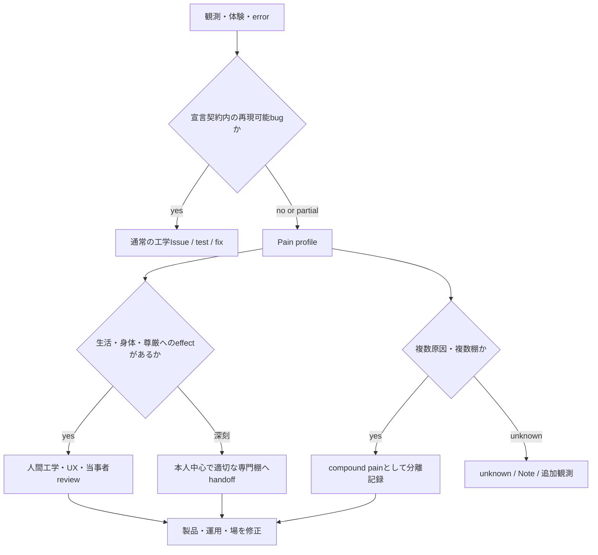

# bug・ペイン・複合ペインとPain Scouter

状態: `ALPHA GUIDE / cross-shelf`

`bug`と`ペイン`は同義ではありません。また、ペインは悪意、虚偽、違法、病気、霊障の判定でもありません。

このガイドでは、普通の工学bugを普通に直しつつ、動いているからこそ生じる脆さ、摩擦、尊厳への誤射、
複数stackのかみ合わせを、別の作業台へ落とさず運ぶ方法を説明します。

## alpha作業語

| 作業語 | 現在の輪郭 | 主な次動 |
|---|---|---|
| bug | 宣言された期待と実際の挙動がずれる | 再現、原因切分け、test、修正 |
| engineering pain | 動くが、脆い、危険、保守困難、悪用可能、環境と相性が悪い | pain profile、隔離、再設計、Issue |
| human-factors pain | 身体、認知、財布、尊厳、離脱、共同体へ負荷が出る | 当事者報告、人間工学、UX、運用修正 |
| compound pain | 複数の独立したpainが別原因のまま結合する | 原因、経路、棚を分け、まとめて単一犯へしない |
| ペインペイン | 修正、評価、同調圧力、別stackの反応が二次painを増幅する状態を示す暫定語 | 一次effectと二次effectを分け、feedback loopを止める |

これらは現在のalpha運用語です。severityの単一数値や医学的尺度ではありません。

## なぜ「動く」が重要か

死んだコードは動作上のpainを発生させません。動く実装があるからこそ、依存、環境差、悪用、wallet、UX、
保守、組織圧力が絡みます。

したがって、非推奨、セキュリティblock、香ばしい独自protocolを見つけたとき、対象の実在性や開発者の悪意を
裁くのではなく、次を調べます。

1. 何が動いた、または止められたか
2. どの環境、authority、依存、入力で発火したか
3. どのpainが観測され、何がまだunknownか
4. 隔離、段階接近、fork、Issue、再設計のどれが適切か

## Pain Scouterの役割

[pain-scouter-assessment](https://github.com/saitoomituru/pain-scouter-assessment)は、査定者、告発者、審判者へ
滑らず、探索者として工学riskを読むためのスキル群です。

Pain Scouterがすること:

- 動的一次証拠、実際のRun、log、請求、利用者報告を尊重する
- 完成度、危険性、悪意、実在性を別軸にする
- セキュリティblockを一律禁止や存在否定へ変換しない
- 枯れたstackと独自protocolを分ける
- 具体的riskと代替アーキテクチャを提示する
- 原因未確定をグレーのまま保持する

Pain Scouterがしないこと:

- 詐欺、犯罪、病気、超自然原因を自動判定する
- painを一つの善悪scoreへ潰す
- 法務、医療、宗教、セキュリティ専門職を代替する
- 一人ラボや非主流実装を、検索hit数だけで不存在扱いする

## 分散系の教師信号として読む

Painは中央AIが主体を採点する罰点ではありません。local node、human、World、actuatorが、自分の観測範囲で
「この接続では期待、実行、意味、Supplyのどれかが噛み合っていない」と返す教師信号です。

```text
local pain report
  -> Sourceと観測範囲を保持
  -> bug / engineering / human-factors / compoundへ分離
  -> 修正できるbranchはIssue化
  -> 外部Supplyや別authorityが必要なbranchは凍結
  -> receiptと再開条件を残す
```

複数のpainが同時に届いても、一つのglobal severityや単一犯へ潰しません。財布、食料、token、身体、model、network、
権限は別原因のまま結合できます。解けるbugを先に直し、解けないbranchには再開条件を付けて凍結することも、
分散系を止めずに回復可能性を残す正規の処理です。

## Routing



専門棚へ渡したことで工学側が免責されるわけではありません。製品が依存やpainを作るfeedback loopを持つなら、
そのloopも修正対象です。

## 例: 廃課金へ寄せたゲーム

コンプ圧力、変動報酬、FOMO、離脱罰、個別最適化を重ねれば、短期KPIが上がることがあります。しかし、
wallet、睡眠、共同体、初心者流入、公平感が同時にpainし、クソゲーレビュー、過疎、サービス終了へ戻る場合があります。

- bug: 表示確率と実際の抽選が違う
- engineering pain: 課金stateと復旧が密結合で事故りやすい
- human-factors pain: 停止しにくい、支出が見えない、羞恥で離脱できない
- compound pain: 課金、ランキング、仲間への責任、限定期間が別原因のまま結合する
- ペインペイン: 苦情対策の過剰防戦が利用者を責め、さらにpainと炎上を増やす

「豆腐メンタルが悪い」は、重すぎる端末を作って筋肉不足を責めるのと同型の人間工学上の責任転嫁です。

## スピ・神学との境界

霊障は、意味次元以上で射程自体がまだ見えない作用またはpainを示すalpha Meaning Bridgeです。
`compound pain = 霊障`、`ペインペイン = 霊障`とはしません。

スピ・神学側がSourceを保持したまま人間工学まで解体できた部分は、工学炉へ投入できます。解体できない部分は、
霊障、妖怪、ソイヤ等の原語を残してNoteへ戻します。工学者は無理な原因を作らず、スピ側も工学、医療、
環境調整等の射程を抱え込みません。

## 既存ITと人間工学を否定しない

Pain Scouterや情報子工学は、lint、unit test、profiling、security review、SRE、UX research、accessibility、
人間工学を置き換えません。それらで切れる問題は、最も具体的な既存手法で切ります。

情報子工学側の追加仕事は、複数の専門結果を、Source、観測器、目的、World、authorityを失わず接続することです。

- [パーミッションで読む分散Agency](../philosophy/permission-spectrum-and-distributed-agency.md)

## Sourceと状態

- Pain Scouter Source: `pain-scouter-assessment/SKILL.md`、last modified commit `b37e547`
- Manifest Source: `docs/theory/infoton-engineering.ja.md`
- 妖怪／霊障／ソイヤ Bridge Source: Manifest `0c87af3`、Atlantis `1a86478`
- この文書はQ Atlantis向けのalpha Presentationで、医学的診断、法的判断、宗派教義、runtime実装ではありません。
