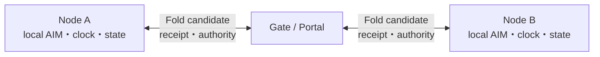
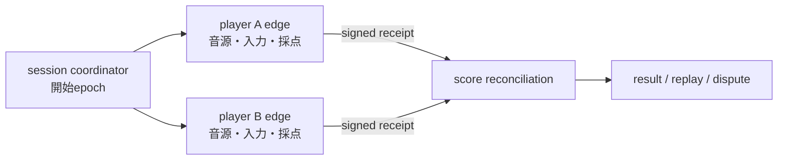

# AIM因果同期・Fold深度・Human-is-the-loop

状態: `ALPHA ARCHITECTURE / Prompt Engineering Edition`


*`ALPHA ARCHITECTURE / NOT IMPLEMENTED`。AIMを物理粒子や測定済み電波fieldとして示す図ではありません。*

この文書は、SphereOS AtlantisのPrompt Engineering Editionで安定し始めた意味契約を、Q Atlantisの
公開面から説明します。AIM Runtime、clock service、Fold transport、standalone OSが実装済みという意味ではありません。

## AIM拡散力場の現在の読み方

AIM拡散力場のSourceは、日本の高context文化で観測される暗黙のsympathy、間、空気読み、阿吽の同期です。
物理粒子や電波fieldの主張ではありません。発達特性によって暗黙同期へ接続しにくかった提唱者が、明示言語、
空間認識、構造理解から外在化した人生規模の観測でもあります。Source testimonyは
[AIM拡散力場――空気読みを外から観測する](../../practice/aim-diffusion-field.md)に保存します。

工学projectionでは、その強さを、単に電波が届くことやpingが小さいことではなく、必要な期限までに、共有する
因果を矛盾なくserializationできる射程として扱うalpha候補です。

```text
AIM strength
  ~= causal serialization coverage
   x deadline satisfaction
   x ordering confidence
   x authority continuity
   x replayability
```

これは測定済みの物理式ではありません。設計時に「何が弱くなったか」を分けるための分解です。

文化的な暗黙同期と、工学上の因果serializationは同一物ではありません。前者から観測可能なeffectを解体し、
後者へ投影しています。全日本人の生得能力、民族的優劣、完成したAIM Runtimeを意味しません。

| 状態候補 | 因果の扱い |
|---|---|
| strong | deadline内に順序、authority、World Configを回復できる |
| degraded | bounded delayとreceiptで後から回復できる |
| weak | 複数の因果解釈が残り、局所AIMへ分裂する |
| disconnected | KernelまたはWorld Configを対応づけられず、Gate／Portalが必要 |

非同期であること自体を失敗にしません。非同期を包む上限、収束、replay契約が失われるほど共有AIMは弱まります。

## AIMは単一マザーのfieldではない

AIM拡散力場を、一つの巨大AIや中央operatorが全nodeへ放射する命令fieldとして設計しません。各human、AI、World、
deviceはlocal AIMを持ち得ます。複数nodeが同じKernel、deadline、authority、World Configを回復できる範囲で共有AIMが
成立し、対応づけられなければ`weak`、`disconnected`、Gate、Portalへ分かれます。



P2P／E2Eはpacket transportや暗号だけで完了しません。Q Atlantisでのend-to-end候補には、owner、Source、authority、
ordering、freshness、Last Order、replay条件が端点間で失われないことも含みます。ただし、現在の本文はtarget
architectureであり、完成したE2E protocol、暗号方式、Fold runtimeの実装証拠ではありません。

## clock domainを分ける

リモート太鼓バトルでは、すべてを中央serverのpacket到着clockへ合わせる必要はありません。



各edgeは、同一楽曲、譜面、難易度、判定revision、calibration、handicap policyを受け取り、local clockで
判定します。serverは生入力のpacket到着時刻で採点せず、後からreceiptを照合できます。

同名楽曲や同じ難易度表示だけでは同一World Configを保証しません。変換規則が必要なら、陸続きの同条件対戦
ではなく、Portal対戦として表示します。

## L、D、Gを混ぜない

```text
L: linear transport / execution stack
D: Fold内へ畳む独立した意味・意図・文脈軸
G: Fold containerを包むnesting depth
```

- L-UPはtransportが通った状態で、意味link-upを保証しない
- Dが多いとは、embedding dimensionや文章量が多いことではない
- Gが深いとは、OSI layerが増えたことではない
- Fold depth 1は通常情報伝達の常圧候補である
- 短いだけで意味を回復できない通信は、高意味圧でなくcontext不足になり得る

`Fold7G`は現在、七つの次元というより七段のnested Foldとして検討されています。各G Registryと正式な
machine contractは未確定です。

Fold8Gは旧系譜名と配置候補が残っていますが、独立した責務とFold7Gとの差分を示すcontractは未抽出です。
「8段目」と推測で埋めず、`unknown`として[研究地図](./fold7g-fold8g-research-map.md)へ分離します。

## latencyはどのloopへ入るか

高Gだから常に低遅延が必要なのではありません。短いfeedback loopへ入るDだけが強くlatencyへ依存します。

- 音楽入力判定: edgeで短いdeadline
- 勝敗集計: receipt到着後でもよい
- 倫理review: 速さより熟考とfreshness
- Note PR: 非同期でもSourceとrevisionが重要
- 即興合奏: 相手出力が次入力原因になるため、deadline超過で因果圏が分裂し得る

## Human-is-the-loop

機械は同一条件、差分、補正、再現性を示せます。しかし、公平で面白いか、rubber-bandが神調整か出来レースか、
意味が度し難くなったかを最終決定できません。

```text
Engineering receipt : 何が起きたか、再現できるか
Spiritual report    : 何が意味的・倫理的に度し難かったか
Gamer report        : 何が退屈・不公平・悪用可能・神調整だったか
```

評価が割れたら平均点で消さず、cluster、mode、World Configを分けます。

## Overrideと減圧DeFold

高G処理を止めて、保持していたContextと責任を説明せず人間へ返すだけでは、`Responsibility Dump`に
なり得ます。Override時は少なくとも次を分けて検討します。

- Emergency Stop: 直ちに止める必要がある操作
- Human Override: 決裁権を持つ主体が自動判断を拒否・変更するEvent
- Graceful Degradation: 一部能力を落としながら安全な機能を維持する
- Controlled DeFold: source/anchorを保持し、G、D、Agency、保留判断、欠損情報を低G面へ段階的に展開renderingする
- Decompression Handover: 引受主体が操作可能になったことを確認して移管する

操作者のauthorityと観測価値も同じではありません。無資格の割込みが異常信号として正しい場合も、資格者の
判断が誤る場合もあります。

```text
Unauthorized Agency != Invalid Observation
Authorized Agency   != Infallible Judgment
```

## 現在能力と未実装

| 項目 | 状態 |
|---|---|
| PLI上のWorld／Kernel／OAE／MAGI説明と停止契約 | Prompt Engineering Editionで利用可能 |
| L/D/GとAIM因果serializationの公開説明 | ALPHA |
| clock uncertainty machine schema | `NOT IMPLEMENTED / unknown` |
| AIM strength validator | `NOT IMPLEMENTED` |
| local AIM間のP2P／E2E handoff contract | `ALPHA TARGET / NOT IMPLEMENTED` |
| Fold7G runtime | `NOT IMPLEMENTED` |
| Fold8G independent contract | `unknown / NOT EXTRACTED` |
| Controlled DeFold trace | `ALPHA HYPOTHESIS / NOT IMPLEMENTED` |
| edge音楽ゲームreference implementation | `NOT IMPLEMENTED` |

## Source

- SphereOS Atlantis `1a86478`, `b03b40b`
- Manifest `0c87af3`, `b73cdf8`
- [Context DimensionとAtlantis World Builder](./context-dimension-world-builder.md)
- [Human-is-the-loopと射程の非独占](../../philosophy/human-is-loop-and-scope-non-monopoly.md)
