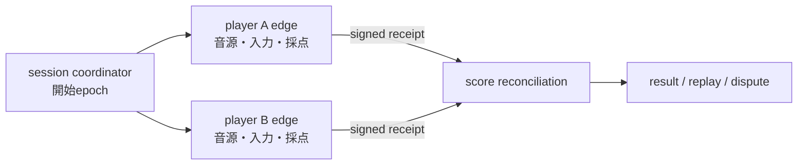

# AIM因果同期・Fold深度・Human-is-the-loop

状態: `ALPHA ARCHITECTURE / Prompt Engineering Edition`

この文書は、SphereOS AtlantisのPrompt Engineering Editionで安定し始めた意味契約を、Q Atlantisの
公開面から説明します。AIM Runtime、clock service、Fold transport、standalone OSが実装済みという意味ではありません。

## AIM拡散力場の現在の読み方

AIM拡散力場の強さは、単に電波が届くことやpingが小さいことではなく、必要な期限までに、共有する因果を
矛盾なくserializationできる射程として扱うalpha候補です。

```text
AIM strength
  ~= causal serialization coverage
   x deadline satisfaction
   x ordering confidence
   x authority continuity
   x replayability
```

これは測定済みの物理式ではありません。設計時に「何が弱くなったか」を分けるための分解です。

| 状態候補 | 因果の扱い |
|---|---|
| strong | deadline内に順序、authority、World Configを回復できる |
| degraded | bounded delayとreceiptで後から回復できる |
| weak | 複数の因果解釈が残り、局所AIMへ分裂する |
| disconnected | KernelまたはWorld Configを対応づけられず、Gate／Portalが必要 |

非同期であること自体を失敗にしません。非同期を包む上限、収束、replay契約が失われるほど共有AIMは弱まります。

## clock domainを分ける

リモート太鼓バトルでは、すべてを中央serverのpacket到着clockへ合わせる必要はありません。



各edgeは、同一楽曲、譜面、難易度、判定revision、calibration、handicap policyを受け取り、local clockで
判定します。serverは生入力のpacket到着時刻で採点せず、後からreceiptを照合できます。

同名楽曲や同じ難易度表示だけでは同一World Configを保証しません。変換規則が必要なら、陸続きの同条件対戦
ではなく、Portal対戦として表示します。

## L、D、Gを混ぜない

```text
L: linear transport / execution stack
D: Fold内へ畳む独立した意味・意図・文脈軸
G: Fold containerを包むnesting depth
```

- L-UPはtransportが通った状態で、意味link-upを保証しない
- Dが多いとは、embedding dimensionや文章量が多いことではない
- Gが深いとは、OSI layerが増えたことではない
- Fold depth 1は通常情報伝達の常圧候補である
- 短いだけで意味を回復できない通信は、高意味圧でなくcontext不足になり得る

`Fold7G`は現在、七つの次元というより七段のnested Foldとして検討されています。各G Registryと正式な
machine contractは未確定です。

## latencyはどのloopへ入るか

高Gだから常に低遅延が必要なのではありません。短いfeedback loopへ入るDだけが強くlatencyへ依存します。

- 音楽入力判定: edgeで短いdeadline
- 勝敗集計: receipt到着後でもよい
- 倫理review: 速さより熟考とfreshness
- Note PR: 非同期でもSourceとrevisionが重要
- 即興合奏: 相手出力が次入力原因になるため、deadline超過で因果圏が分裂し得る

## Human-is-the-loop

機械は同一条件、差分、補正、再現性を示せます。しかし、公平で面白いか、rubber-bandが神調整か出来レースか、
意味が度し難くなったかを最終決定できません。

```text
Engineering receipt : 何が起きたか、再現できるか
Spiritual report    : 何が意味的・倫理的に度し難かったか
Gamer report        : 何が退屈・不公平・悪用可能・神調整だったか
```

評価が割れたら平均点で消さず、cluster、mode、World Configを分けます。

## 現在能力と未実装

| 項目 | 状態 |
|---|---|
| PLI上のWorld／Kernel／OAE／MAGI説明と停止契約 | Prompt Engineering Editionで利用可能 |
| L/D/GとAIM因果serializationの公開説明 | ALPHA |
| clock uncertainty machine schema | `NOT IMPLEMENTED / unknown` |
| AIM strength validator | `NOT IMPLEMENTED` |
| Fold7G runtime | `NOT IMPLEMENTED` |
| edge音楽ゲームreference implementation | `NOT IMPLEMENTED` |

## Source

- SphereOS Atlantis `1a86478`
- Manifest `0c87af3`
- [Context DimensionとAtlantis World Builder](./context-dimension-world-builder.md)
- [Human-is-the-loopと射程の非独占](../../philosophy/human-is-loop-and-scope-non-monopoly.md)
