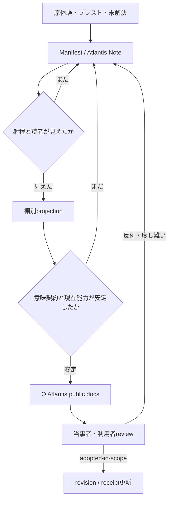

# 棚別文書レジスターと公開パイプライン

状態: `ALPHA / OPERATING GUIDE`

この文書は、ManifestやAtlantisのNoteから、Q Atlantisの公開文書へ何を配信し、何をまだ配信しないかを
判断する運用ガイドです。各棚を一つの説明へ平均化せず、同じSourceから読者ごとのPresentationを作ります。

## 三つの置場

| 置場 | 置くもの | 置かないもの |
|---|---|---|
| ZeroRoomLab-manifest | 横断原則、原語ブレスト、正本router、転送履歴 | Sphere固有runtimeの実装正本 |
| SphereOS Atlantis | AIM、OAE、World、Fold、MAGI、interface等のSphere固有契約と実装状態 | 全宗派・全ゲームの唯一の解釈 |
| Q Atlantis | 安定部分を読者別に再構成した公開Presentation、参加入口、状態案内 | 生Noteの無加工複製、開発中の内臓 |

Q Atlantisへ移した説明が、元Note全体や別repositoryの正本を所有したことにはなりません。

## 公開までの流れ



生Noteを公開文書へ改名しません。公開文書はSource、抽出範囲、転送しなかった部分、兄弟Presentationを
追跡できるようにします。

## Noteへ残すもの

- 妖怪、霊障、ソイヤ等、射程または因果がまだ閉じていない観測
- 当事者の原語、信仰告白、クソゲー感、身体感覚
- MAGI Position間で結論が割れているもの
- 名称、schema、authority、責務が検討中のもの
- 開発中機能、失敗、未知の技術課題
- 宗派、World、ゲーマークラスターごとの反対証言

`unknown`は公開失敗ではありません。無理なBridgeを作らず、NoteとIssueへ戻す正規の停止状態です。

## 公開文書へ展開できるもの

- Prompt Engineering Editionで現在利用できる機能
- 意味契約、責務、停止条件が安定したMAGI、Archangel、Fold等
- 読者へ約束できる操作、境界、権限、失敗表示
- 実装済み、Prompt運用成立、未実装、未試験を分離できる説明
- Source、version、Provenance、receiptを参照できる内容

Pythonまたはbinaryでないことを理由にPLI上の機能を偽物扱いしません。同時に、Prompt上で機能することを
standalone runtime実装済みとも表示しません。

## 棚ごとのレジスター

| 棚 | 主な問い | 表現上の責務 |
|---|---|---|
| 体験・信仰・実践 | 何を感じ、祈り、祀り、どう場を運用したか | 原語、TPO、宗派、当事者性を保持する |
| 神話・神学・World | どのWorldと因果定規で何が実在・作用するか | 別宗派・別Worldへ無断で一般化しない |
| 哲学 | 主体、意味、自由、尊厳、退出、責任とは何か | 問いを実装可否だけで閉じない |
| ゲーム | 面白いか、公平か、攻略・悪用・分岐が成立するか | プレイスタイル差を平均点で消さない |
| 研究 | 何を観測し、比較し、仮説として試せるか | 類似、比喩、仮説、証拠を分ける |
| 工学 | 何が動き、誰が何をでき、どう失敗するか | interface、状態、authority、receiptを分ける |

同じ概念を複数棚で扱っても、同じ文章を複製しません。

## 公開文書の最小receipt

公開文書は本文または転送台帳で、可能な範囲の次の情報を持ちます。

```yaml
source_refs: []
projection_for: spiritual | theology | philosophy | gamer | engineering
claim_layers: [A, B, C]
content_status: DRAFT | REVIEW | ALPHA | PUBLISHED
interface: prompt-line | command-line | gui | document
execution_envelope: []
implemented_scope: []
not_implemented: []
preserved_unknowns: []
sibling_projections: []
```

これは現在の文書運用項目であり、Sphere runtimeの確定schemaではありません。

## 妖怪・霊障・ソイヤの強度

これらは単なる検討材料ではなく、初動、聞き返し、引継ぎ先を選ぶために使える
`ALPHA provisional meaning bridge`です。ただし確定ontology、診断器、特定宗派の教義ではありません。

alpha運用で得た反例、宗派差、当事者reviewを残し、工学側だけで改訂権を独占しません。詳しい読者別説明は、
各棚の文書へ分けて配信します。

## 停止条件

次の場合は、公開文書へ無理に接続しません。

- 既存MAGI、OAE、World、SemanticKernel契約と論理矛盾する
- 複数の定規を合成するとSourceの意味またはauthorityが消える
- 未知の技術課題を実装済みとしてしか説明できない
- 特定宗派の解釈を別宗派へ強制する
- 当事者の原語を人間工学projectionだけで置換する

その場合はSourceを保持し、NoteとIssueへ事実、仮説、衝突、必要なUser Gateを書いて停止します。

## Sourceと受領

- Manifest Source: `0c87af3` — 棚間Meaning BridgeとQ配信候補
- Atlantis Source: `1a86478` — AIM同期と暫定Meaning Bridge
- 受領台帳: `pipeline/transfer-queue.json`
- 本文はSourceの逐語複製ではなく、Q Atlantis運用向けの現在Presentationです。
