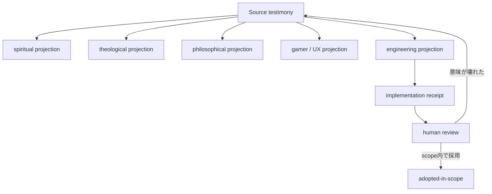

# Human-is-the-loopと射程の非独占

状態: `ALPHA PHILOSOPHY / Layer B-C bridge`

人間を機械判定の最後に置く承認ボタンとしてだけ扱うと、「測れないが重要なもの」は設計の外へ落ちます。

ゲームが面白いか、意訳が度し難いか、祭りが成立したか、公平な補正か出来レースかを評価する場面では、
人間は`Human-in-the-loop`というより、評価loopそのものです。この候補を`Human-is-the-loop`と呼びます。

## 人間は飾りの承認器ではない

機械は次を検査できます。

- revision、clock、state、authority
- 入力と出力
- 判定規則、確率、支出、補正履歴
- 再現性、差分、失敗、receipt

しかし、その条件で遊び続けたいか、意味が壊れたか、当事者の尊厳が削られたかは、機械試験だけでは
閉じません。人間の報告は、機械試験の精度不足を埋める低品質dataではなく、別の観測器からの入力です。

## 否定しないことと抱え込まないこと

他棚を否定しないことは、すべての主張を無制限に承認することではありません。また、自棚で全部を説明する
権利でもありません。

```text
スピの過剰抱え込み  -> 何でも霊的原因へ回収し、祓いとhandoffを失う
工学の過剰抱え込み -> 何でもKPIと仕様へ回収し、意味と退出を失う
医療の過剰抱え込み -> 文化、信仰、製品事故を医療化する
神学の過剰抱え込み -> 何でも悪、罪、敵対主体へ集約する
```

必要なのは無責任な役割分散ではなく、責任の多重化です。

- 原語と当事者の体験を消さない
- 自棚で扱えるeffectだけを引き受ける
- 射程外を`unknown`または`⊥`として返す
- 他棚へ渡しても、自分が作った原因と修正責任を捨てない
- 解釈が競合したら、同じ結論へ平均化せず並存させる

## Sourceとprojection

一つの体験から複数の説明が作られても、元の体験が置換されるわけではありません。



`engineering projection`が実装できても、Sourceの意味全体を実装したことにはなりません。スピや神学の
解釈が成立しても、softwareのtestが通ったことにはなりません。

## クラスター差を残す

ゲーマーにはRTA、TAS、縛り、効率、エンジョイ、roleplay等があり、宗教実践にも宗派、流派、共同体、
個人実践があります。

同じ補正、言葉、祭り、Worldが、あるクラスターには神調整、別のクラスターには度し難いことがあります。
平均点で消さず、誰のどの定規でどう評価されたかを残します。必要ならmode、World、Portalを分けます。

## 自由と境界

- 信じる自由は、他者へ同じ信仰を強制する権利ではない
- 疑う自由は、当事者の体験を不存在にする権利ではない
- 実装する自由は、feedbackを潰す権利ではない
- 仕様を決める自由は、退出と異議を消す権利ではない
- 遊び方の自由は、他クラスターを下手だからと無効化する権利ではない

AtlantisのCoreが行うのは、どの立場が真理かを決めることではなく、誰がどの定規をどのscopeで使い、
何を変換し、何を変換できなかったかを残すことです。

## Source

- Manifest `0c87af3`
- SphereOS Atlantis `1a86478`
- [棚別文書レジスターと公開パイプライン](../operations/cross-shelf-publication-register.md)
- `Human-is-the-loop`のstable IDとmachine tokenは未確定です。
